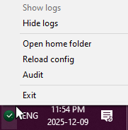
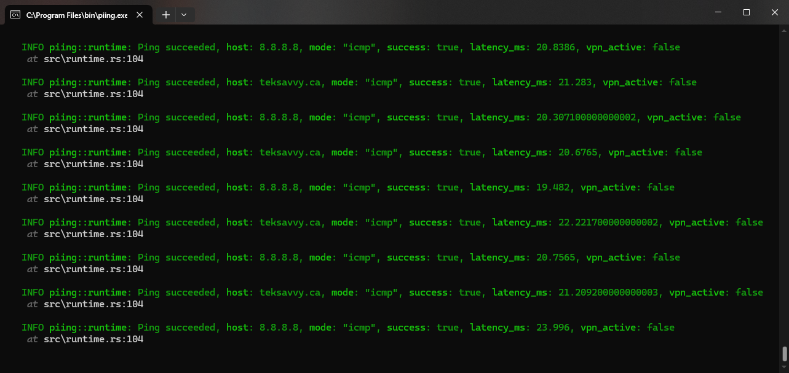
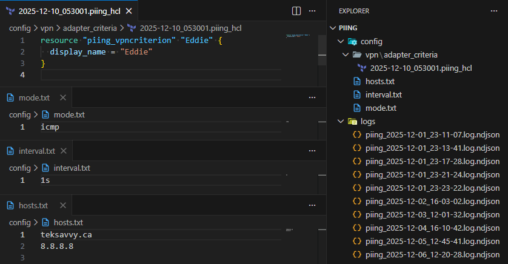

<div align="center">
    <h1>📡 Piing</h1>
    <br/>

[Voir la version française](./README.fr_ca.md)

</div>

## Description

A continuous ping utility that lives in the system tray.

Takes measurements over time for the purpose of identifying network performance trends and outage incidents, maintaining awareness of VPN connectivity as a possible contributing factor to dropped requests.

## Gallery


The app comes with a system tray icon



The console is hidden by default but can be opened to view real-time logs



The home directory stores configuration, logs, and VPN criteria in simple open formats



## Output

The app stores newline-delimited JSON (ndjson) log files in `$PIING_HOME/logs/` by default. Each ping result is logged with a timestamp, host, mode, success status, latency, and VPN context.

```json
{"timestamp":"2025-12-02T04:17:28.879441Z","level":"INFO","fields":{"message":"Ping succeeded","host":"8.8.8.8","mode":"icmp","success":true,"latency_ms":23.2756}}
{"timestamp":"2025-12-02T04:17:29.909676Z","level":"INFO","fields":{"message":"Ping succeeded","host":"8.8.8.8","mode":"icmp","success":true,"latency_ms":22.2433}}
{"timestamp":"2025-12-02T04:17:30.935951Z","level":"INFO","fields":{"message":"Ping succeeded","host":"8.8.8.8","mode":"icmp","success":true,"latency_ms":24.1527}}
```

## Configuration

### Mode

Piing supports multiple ping modes:
- `icmp`: Standard ICMP echo requests (requires elevated privileges on some OSes)
- `tcp`: TCP SYN packets to port 80/443
- `http-head`: HTTP HEAD requests to the host
- `http-get`: HTTP GET requests to the host

### VPN Detection

Piing includes VPN adapter detection with HCL-based configuration to automatically identify when VPN connections are active, providing context for ping performance data.

## Usage

```
❯ piing --help
TeamDman's Windows tray ping utility

Usage: piing.exe [OPTIONS] [COMMAND]

Commands:
  run       Launch the tray application and ping monitors
  host      Manage the list of hosts to ping
  mode      Configure ping mode
  interval  Configure ping interval
  audit     Audit log files
  vpn       Manage VPN related commands
  help      Print this message or the help of the given subcommand(s)

Options:
      --debug            Enable verbose debug logging
      --log-file <FILE>  Write structured ndjson logs to this file instead of the default in `$PIING_HOME/logs`
  -h, --help             Print help
  -V, --version          Print version
```

Full command tree:

```
piing help # Show help
piing run # Start the tray application, default behaviour when no arguments
piing host [add|remove|list] # Manage ping hosts
piing mode [set|get] # Configure ping mode
piing interval [set|get] # Configure ping interval
piing audit # Audit ping log files
piing vpn [check|adapter [add|remove|list|get-path]] # Manage VPN related commands
```

## Copyright

Copyright belongs to © His Majesty the King in Right of Canada, as represented by the Minister of Agriculture and Agri-Food, 2025.